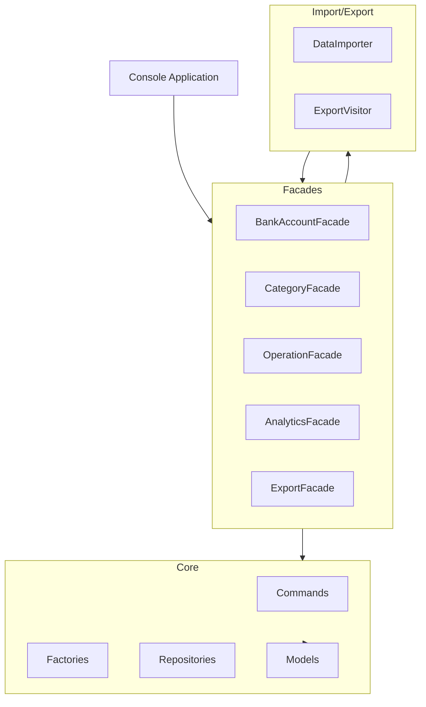
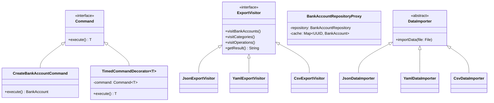

# HSE Finance App

## Описание проекта

Приложение для учета финансов, разработанное в рамках контрольной работы по паттернам проектирования. 
Позволяет отслеживать доходы и расходы, группировать их по категориям, проводить аналитику и импортировать/экспортировать данные.

## Функциональность

1. **Работа с доменной моделью**:
   - Создание, редактирование и удаление счетов, категорий, операций

2. **Аналитика**:
   - Подсчет разницы доходов и расходов за выбранный период
   - Группировка операций по категориям
   - Анализ топ-категорий по расходам
   - Анализ трендов по месяцам для категорий

3. **Импорт и экспорт данных**:
   - Экспорт данных в CSV, YAML, JSON
   - Импорт данных из CSV, YAML, JSON

4. **Управление данными**:
   - Пересчет баланса счетов

## Используемые принципы SOLID и GRASP

1. **Single Responsibility Principle (SRP)**: 
   - Каждый класс имеет только одну причину для изменения
   - Например, класс `BankAccount` отвечает только за данные счета, а `BankAccountRepository` - за хранение счетов

2. **Open/Closed Principle (OCP)**:
   - Расширение функциональности без изменения существующего кода
   - Например, новые форматы импорта/экспорта можно добавлять без изменения существующих классов

3. **Liskov Substitution Principle (LSP)**:
   - Подтипы могут заменять базовые типы без нарушения работы программы
   - Все реализации `ExportVisitor` могут быть использованы в `ExportFacade` без изменения его кода

4. **Interface Segregation Principle (ISP)**:
   - Интерфейсы разделены на специфические части
   - Например, `Command<T>` имеет только один необходимый метод `execute()`

5. **Dependency Inversion Principle (DIP)**:
   - Зависимость от абстракций, а не от конкретных реализаций
   - Использование Spring DI для внедрения зависимостей

6. **GRASP: Low Coupling**:
   - Минимальная зависимость между компонентами
   - Использование фасадов для инкапсуляции взаимодействия между компонентами

7. **GRASP: High Cohesion**:
   - Связанная функциональность сгруппирована вместе
   - Например, все операции с категориями находятся в `CategoryFacade`

## Используемые паттерны проектирования GoF

1. **Фабрика (Factory)**:
   - `BankAccountFactory`, `CategoryFactory`, `OperationFactory`
   - Обеспечивает централизованное создание объектов с валидацией

2. **Фасад (Facade)**:
   - `BankAccountFacade`, `CategoryFacade`, `OperationFacade`, `AnalyticsFacade`, `ExportFacade`
   - Предоставляет унифицированный интерфейс для связанной функциональности

3. **Команда (Command)**:
   - `CreateBankAccountCommand`, `UpdateBankAccountCommand`, `DeleteBankAccountCommand`
   - Инкапсулирует запрос как объект

4. **Декоратор (Decorator)**:
   - `TimedCommandDecorator`
   - Добавляет новую функциональность (измерение времени) без изменения существующих классов

5. **Шаблонный метод (Template Method)**:
   - `DataImporter` с абстрактным методом `parseFile`
   - Определяет структуру алгоритма, позволяя подклассам переопределить определенные шаги

6. **Посетитель (Visitor)**:
   - `ExportVisitor` и его реализации
   - Позволяет добавлять новые операции без изменения классов объектов

7. **Прокси (Proxy)**:
   - `BankAccountRepositoryProxy`
   - Предоставляет кэширование данных из репозитория

## Инструкции по запуску

1. Убедитесь, что у вас установлена Java 17 или выше
2. Клонируйте репозиторий
3. Соберите проект с помощью Maven:

```bash
mvn clean package
```

4. Запустите приложение:

```bash
java -jar target/finance-1.0-SNAPSHOT.jar
```

## Примеры использования

1. **Создание счета и категорий**:
   - Выберите пункт "Manage Bank Accounts" -> "Create Account"
   - Выберите пункт "Manage Categories" -> "Create Category"

2. **Добавление операций**:
   - Выберите пункт "Manage Operations" -> "Create Operation"

3. **Анализ данных**:
   - Выберите пункт "Analytics" и нужный тип анализа

4. **Экспорт/Импорт данных**:
   - Выберите пункт "Export Data" или "Import Data" 

## Архитектура приложения

Примерные диаграммы архитектуры (чтобы посмотреть в маркдауне нужно либо поставить плагин mermaid для ide либо просто на гитхабе оно автоматически отображается, даже немного интерактивно)



## Диаграмма паттернов проектирования



## Запуск с Java 23

При использовании Java 23 может возникнуть проблема (и у меня возникала) с библиотекой Mockito в тестах из-за несовместимости с библиотекой ByteBuddy, которая официально поддерживает только до Java 22.

Для решения этой проблемы используйте следующий флаг при запуске тестов:

```bash
JAVA_TOOL_OPTIONS="-Dnet.bytebuddy.experimental=true" mvn test
```

Флаг `-Dnet.bytebuddy.experimental=true` включает экспериментальную поддержку более новых версий Java в библиотеке ByteBuddy, что позволяет Mockito корректно создавать моки в тестах даже при использовании Java 23. 